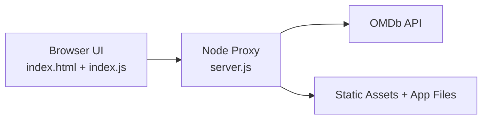
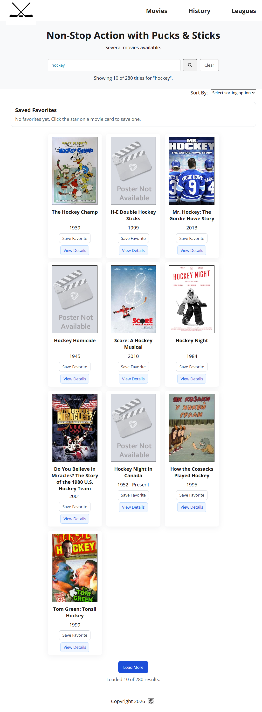
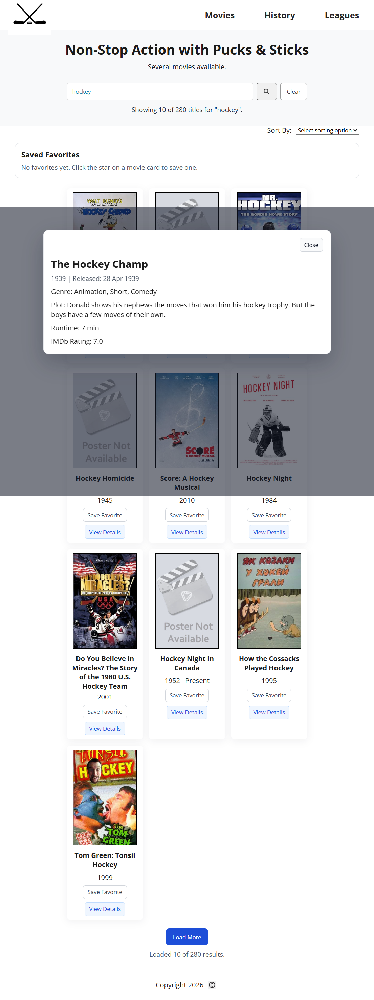
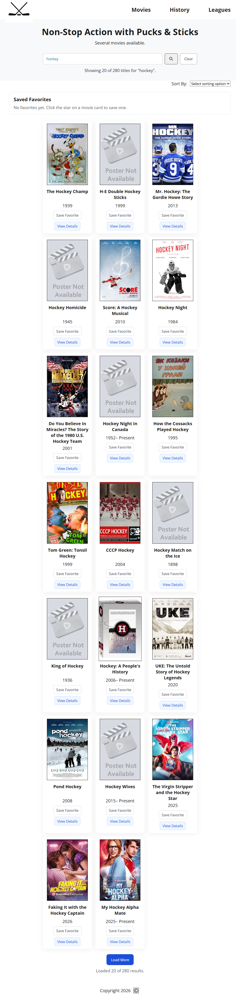

# Hockey Movies Explorer

A responsive movie discovery app powered by the OMDb API, focused on hockey-related titles with fast search, sorting, and clean card-based browsing.

## Portfolio Ready

- Strong project narrative with a clear rebuild story and lessons learned
- Deterministic unit, e2e, and release-gate coverage
- Secure proxy layer with validation, rate limiting, and server-side API key handling
- Responsive UI with accessible controls, focus states, and modal interactions
- Deployment instructions for hosting the app publicly through a backend-capable platform

## Run In 2 Commands

1. npm install
2. npm start

Open http://localhost:3000 in your browser.

## Live Features

- Search movies by title with submit and debounced input behavior
- Sort results alphabetically or by year range
- Loading, no-results, and error feedback states in the UI
- Poster fallback image when external posters fail
- Save favorites with local storage persistence
- Movie details modal with plot, genre, runtime, and rating
- Automated tests for sorting and year-format utility logic
- Load-more pagination for larger OMDb result sets
- Local backend proxy starter to keep OMDb key out of browser code
- Proxy hardening with request validation, security headers, and gentle rate limiting
- GitHub Actions CI workflow running unit and Playwright e2e tests
- CI artifact upload for Playwright reports on failed runs
- Playwright end-to-end tests for modal, pagination, no-results, and API-error flows
- Automated release workflow with version bump and changelog update
- Keyboard-accessible controls and improved focus states
- Mobile-friendly responsive layout

## Development Journey

This project was built about three weeks into my front-end program, while I was still very new to JavaScript and API work.

- Version 1 was hardcoded movie data, which worked visually but was not scalable.
- Version 2 switched to API data, but I hit several issues with rendering and interaction logic.
- I restarted and rebuilt key pieces to fix architecture mistakes and make the app dynamic.

Main lessons learned:

- Hardcoding can help bootstrap quickly, but dynamic data requires stronger structure.
- Rebuilding from scratch can be faster than patching weak foundations.
- Debugging and iteration are part of real development, especially early on.

## Architecture

## Demo Walkthrough

1. Search for a term like hockey or star.
2. Sort results by title or release year.
3. Open View Details on any card to show modal data.
4. Save and remove favorites.
5. Click Load More to fetch additional result pages.

## Demo Screenshots

Home View:

Movie Details Modal:

Load More Results:

## Lighthouse Snapshot (Local)

Audit target: http://localhost:3000

- Performance: 71
- Accessibility: 100
- Best Practices: 96
- SEO: 91

Raw report: docs/lighthouse/lighthouse-report.json

## Tech Stack

- HTML5
- CSS3
- Vanilla JavaScript (ES6+)
- OMDb API
- Font Awesome icons

## Project Structure

- index.html: Main page markup and semantic layout
- style.css: Styling, responsive behavior, and accessibility-focused states
- index.js: API calls, rendering, sorting, search logic, and UI state management
- Assets/: Local static images and poster fallback

## Getting Started

1. Clone or download the project.
2. Open the project folder in VS Code.
3. Ensure index.env contains API_KEY=your_omdb_key.
4. Run npm start to launch the local proxy at http://localhost:3000.
5. Run with Live Server or open index.html directly in a browser.

## Usage

1. Type in the search box to trigger debounced search.
2. Press Enter or click the search button for immediate search.
3. Use Sort By to reorder results.
4. Click Clear to reset search and reload default hockey titles.
5. Click Load More to fetch additional result pages.

## Testing

1. Open a terminal in the project root.
2. Run npm test.
3. Confirm all utility tests pass.
4. Run npx playwright install chromium once.
5. Run npm run test:e2e for end-to-end smoke tests covering modal, pagination, no-results, and API-error states.
6. Run npm run healthcheck while the server is running.
7. Run npm run release:check for one-command pre-release verification.

## Release Automation

1. Local release prep: npm run release:prepare
2. Manual changelog refresh: npm run changelog:update
3. GitHub release workflow: run Release workflow with patch, minor, or major bump.
4. Workflow updates package version, updates changelog, commits, tags, and pushes.

## Deployment Notes

Render:

1. Keep render.yaml in the project root.
2. Create a new Web Service from this repo.
3. Set API_KEY in Render environment variables.
4. Deploy and use the generated app URL.

Vercel:

1. Use Vercel for the static front end if you split the proxy into a backend service.
2. Keep API_KEY only in the backend environment, never in the browser bundle.
3. Add the deployed URL to this README once the public app is live.
4. Run the health check against the public backend URL after deployment.

Railway:

1. Create a new project from this repo.
2. Add API_KEY in project variables.
3. Railway will use npm start automatically.
4. Use the generated public URL for the app.

Production Checklist:

1. Set API_KEY in your host environment variables.
2. Deploy the app with npm start.
3. Verify your deployed endpoint using HEALTH_URL=https://your-app-url/health npm run healthcheck.
4. For stricter validation, run REQUIRE_API_KEY=true HEALTH_URL=https://your-app-url/health npm run healthcheck:require-key.
5. Run npm run release:check before each release.
6. If traffic is high, tune RATE_LIMIT_MAX_REQUESTS and RATE_LIMIT_WINDOW_MS.

## Accessibility Notes

- Search input has clear labeling for assistive technologies.
- Status updates are announced with live regions.
- Interactive elements include visible focus styles.

## Known Limitations

- Proxy is local-only right now and not deployed to a hosted backend.
- OMDb may return incomplete poster/year metadata for some titles.

## Next Improvements

- Deploy the proxy as a hosted backend for production use
- Add a public live URL from deployed hosting
- Add Lighthouse score snapshot for deployed desktop and mobile runs

## Credits

- OMDb API: https://www.omdbapi.com/
- Icons: https://fontawesome.com/
